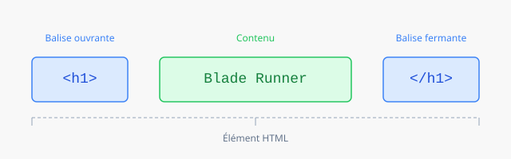
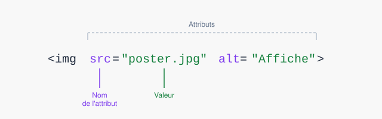
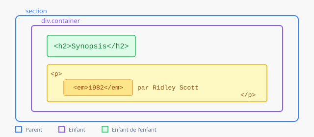
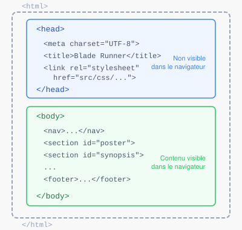

# Introduction au HTML

Le HTML (HyperText Markup Language) est le langage qui structure le contenu d'une page web. Tous les sites que vous visitez utilisent du HTML — c'est le squelette d'un site, son rôle étant de définir la nature et la hiérarchie de chaque contenu.

Le HTML ne s'occupe pas de l'apparence visuelle — c'est le rôle du CSS. Un fichier HTML décrit *ce qu'est* le contenu (un titre, un paragraphe, une image, une liste) ; le CSS décrit *comment il est affiché* (couleur, taille, position).

---

## Balises et éléments

Un document HTML est un fichier texte dont la syntaxe repose sur un système de **balises**. Une balise décrit le rôle d'un contenu et indique au navigateur comment le traiter.

### Syntaxe d'une balise

Toutes les balises s'écrivent entre chevrons :

```html
<section>
<h1>

```

La plupart des balises fonctionnent en paires : une balise **ouvrante** et une balise **fermante**. La balise fermante est identique à la balise ouvrante, avec un `/` ajouté après le chevron ouvrant. Le contenu placé entre les deux forme un **élément HTML**.



```html
<h1>Titre du film</h1>
<p>Un paragraphe de texte.</p>
<section>Un bloc de contenu</section>
```

### Balises autofermantes

Certains éléments n'ont pas de contenu textuel — ils sont définis uniquement par leurs attributs. Ces balises n'ont pas besoin d'être fermées :

```html

<br>
```

---

## Attributs

Les attributs précisent le fonctionnement d'une balise. Ils s'écrivent à l'intérieur de la balise ouvrante, sous forme de paires `clé="valeur"` :



```html

<a href="https://imdb.com" target="_blank">Voir sur IMDB</a>
<section id="synopsis">...</section>
```

Les attributs les plus courants dans ce projet :

| Attribut | Rôle | Exemple |
|----------|------|---------|
| `src` | Source d'une image | `src="assets/images/hero.jpg"` |
| `alt` | Description d'une image (accessibilité) | `alt="Harrison Ford dans Blade Runner"` |
| `href` | Cible d'un lien | `href="#synopsis"` |
| `id` | Identifiant unique d'un élément | `id="synopsis"` |
| `class` | Classe CSS à appliquer | `class="section container"` |

> **Important :** toujours utiliser des guillemets droits `"` et non des guillemets typographiques `" "`. Les guillemets typographiques cassent le code.

---

## Imbrication

Les éléments HTML s'imbriquent les uns dans les autres. L'élément extérieur est le **parent**, les éléments intérieurs sont les **enfants**. Il n'y a pas de limite au nombre de niveaux d'imbrication.



```html
<section id="synopsis">
  <div class="container">
    <h2>L'histoire</h2>
    <p>En 2019, dans une Los Angeles futuriste...</p>
  </div>
</section>
```

Règle absolue : **les balises doivent se fermer dans l'ordre inverse où elles ont été ouvertes**. Cette syntaxe est invalide :

```html
<!-- ❌ Incorrect — les balises se croisent -->
<p><strong>Texte</p></strong>

<!-- ✓ Correct -->
<p><strong>Texte</strong></p>
```

---

## Structure d'une page HTML

Tout fichier HTML valide suit cette structure de base :



```html
<!DOCTYPE html>
<html lang="fr">

<head>
  <!-- Métadonnées — non visibles dans le navigateur -->
  <meta charset="UTF-8">
  <meta name="viewport" content="width=device-width, initial-scale=1.0">
  <title>Titre de la page</title>
  <link rel="stylesheet" href="src/css/framework.css">
  <link rel="stylesheet" href="src/css/style.css">
</head>

<body>
  <!-- Contenu visible de la page -->
</body>

</html>
```

**`<head>`** — informations sur la page, non visibles dans le navigateur : encodage, titre de l'onglet, liens vers les fichiers CSS, polices de caractères.

**`<body>`** — tout le contenu visible : navigation, sections, footer.

---

## Les balises essentielles

### Titres et paragraphes

Les balises de titre `h1` à `h4` définissent la hiérarchie du contenu. `h1` est le titre principal de la page — il ne doit apparaître qu'une seule fois.

```html
<h1>Blade Runner</h1>
<h2>Synopsis</h2>
<h3>Acte I — La chasse commence</h3>
<p>En 2019, Rick Deckard est un ancien policier...</p>
```

### Mise en forme inline

```html
<p>Un film de <strong>Ridley Scott</strong>, sorti en <em>1982</em>.</p>
```

- `<strong>` — texte important (affiché en gras par défaut)
- `<em>` — texte en emphase (affiché en italique par défaut)

### Liens

```html
<!-- Lien externe — s'ouvre dans un nouvel onglet -->
<a href="https://www.imdb.com/title/tt0083658/" target="_blank">Blade Runner sur IMDB</a>

<!-- Lien interne — ancre vers une section de la même page -->
<a href="#synopsis">Lire le synopsis</a>
```

L'attribut `href="#id"` permet de naviguer directement vers une section identifiée par son `id` — c'est la base de la navigation dans un site scrollytelling.

### Images

```html

```

L'attribut `alt` est obligatoire — il décrit l'image pour les lecteurs d'écran et s'affiche si l'image ne charge pas. Toujours le remplir avec une description utile.

Pour une image avec une légende, utiliser `<figure>` et `<figcaption>` :

```html
<figure>
  
  <figcaption>Ridley Scott et Harrison Ford sur le tournage, Los Angeles, 1981</figcaption>
</figure>
```

### Listes

```html
<!-- Liste à puces -->
<ul>
  <li>Harrison Ford — Rick Deckard</li>
  <li>Rutger Hauer — Roy Batty</li>
  <li>Sean Young — Rachael</li>
</ul>

<!-- Liste numérotée -->
<ol>
  <li>Blade Runner (1982)</li>
  <li>Blade Runner 2049 (2017)</li>
</ol>
```

### Liste de définitions — fiche technique

La balise `<dl>` est idéale pour les fiches techniques. Elle fonctionne avec des paires `<dt>` (terme) et `<dd>` (définition) :

```html
<dl class="data-list">
  <dt>Réalisation</dt>
  <dd>Ridley Scott</dd>

  <dt>Scénario</dt>
  <dd>Hampton Fancher, David Peoples</dd>

  <dt>Durée</dt>
  <dd>1h 57min</dd>
</dl>
```

La classe `.data-list` du framework met en forme cette liste en deux colonnes.

### Citation

```html
<blockquote>
  « All those moments will be lost in time, like tears in rain. »
  <cite>— Roy Batty, Blade Runner (1982)</cite>
</blockquote>
```

### Vidéo et audio

```html
<!-- Vidéo YouTube intégrée -->
<iframe src="https://www.youtube.com/embed/ID_VIDEO" allowfullscreen></iframe>

<!-- Audio -->
<audio controls>
  <source src="assets/audio/vangelis.mp3" type="audio/mpeg">
</audio>
```

---

## Balises de structure

Ces balises permettent de diviser la page en zones logiques. Elles n'ont pas d'apparence visuelle par défaut — leur rôle est sémantique.

| Balise | Rôle |
|--------|------|
| `<nav>` | Navigation — menu, liens d'ancrage |
| `<section>` | Section thématique de la page |
| `<article>` | Contenu autonome — portrait d'un acteur, critique |
| `<figure>` | Image avec légende |
| `<figcaption>` | Légende d'une figure |
| `<footer>` | Pied de page |
| `<div>` | Conteneur générique sans signification sémantique |
| `<span>` | Conteneur inline générique |

Dans le projet, chaque grande section est une balise `<section>` avec un `id` :

```html
<section id="synopsis" class="section">
  <div class="container">
    <!-- Contenu de la section -->
  </div>
</section>
```

L'`id` sert à deux choses : la navigation par ancre dans le menu, et le ciblage CSS dans `style.css`.

---

## Classes CSS

Les classes CSS sont le lien entre le HTML et le CSS. On les ajoute via l'attribut `class` :

```html
<!-- Une classe du framework -->
<section class="section">...</section>

<!-- Plusieurs classes combinées -->
<div class="columns-6-6 gap-32">...</div>

<!-- Une classe personnalisée définie dans style.css -->
<h1 class="hero-title">Blade Runner</h1>
```

Dans `style.css`, on définit ensuite le style :

```css
.hero-title {
  color: var(--color-accent);
  font-size: var(--text-xtra-large);
}
```

> **Règle du projet :** les classes du framework (`.section`, `.container`, `.columns-*`, etc.) sont documentées dans [Framework CSS](./framework.md). Les classes personnalisées s'écrivent dans `style.css`.

---

## L'inspecteur du navigateur

L'inspecteur est l'outil le plus utile pour déboguer son code. Il permet de voir le HTML et le CSS en temps réel et d'expérimenter des modifications directement dans le navigateur.

**Ouvrir l'inspecteur :**
- Clic droit sur n'importe quel élément de la page → **Inspecter**
- Ou `F12` / `Cmd+Option+I`

Dans l'onglet **Elements**, naviguer dans l'arbre HTML. Dans le panneau **Styles** à droite, voir et modifier temporairement toutes les règles CSS appliquées.

> Les modifications faites dans l'inspecteur disparaissent au rechargement. C'est un espace d'expérimentation, pas d'édition.
