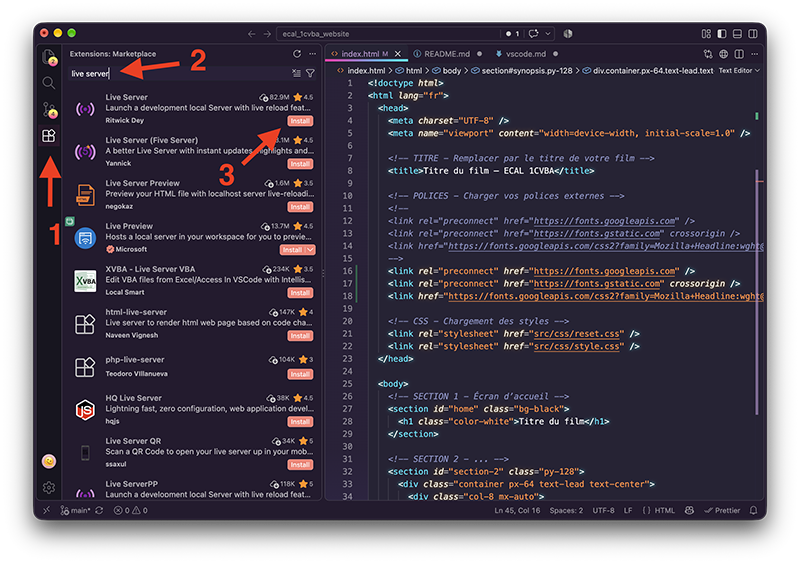
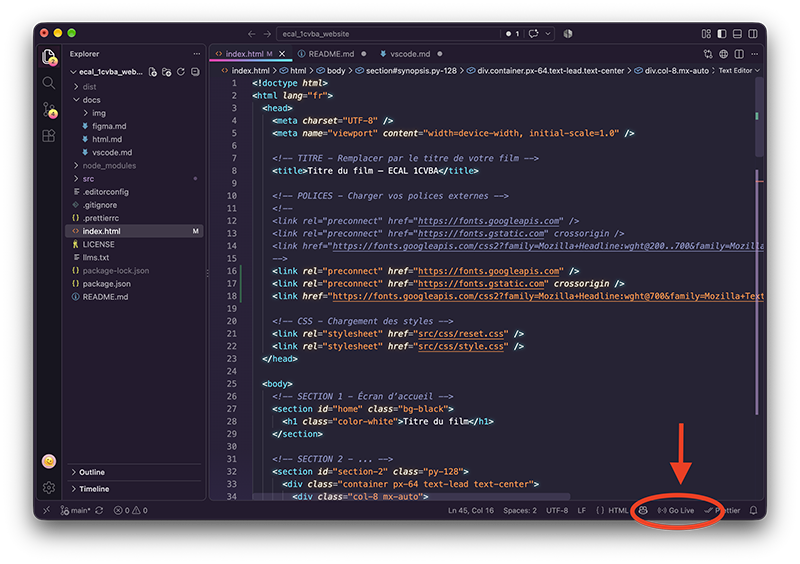

# Installation et mise en route

Ce guide explique comment installer les outils et démarrer le projet. Suivre les étapes dans l'ordre — chaque étape suppose que la précédente est faite.

**Ce dont on a besoin :**
- Un ordinateur sous macOS ou Windows
- Une connexion internet
- Une adresse e-mail ECAL (`prenom.nom@ecal.ch`)
- Un compte Figma (celui utilisé pour la maquette)

---

## Étape 1 — Installer VS Code

VS Code est l'éditeur de code utilisé pour tout le projet.

1. Aller sur [code.visualstudio.com](https://code.visualstudio.com)
2. Cliquer sur **Download** — le site détecte automatiquement le système
3. Ouvrir le fichier téléchargé et installer l'application
4. Lancer VS Code

> **macOS :** faire glisser l'icône VS Code dans le dossier Applications. Si macOS bloque l'ouverture, aller dans Réglages système → Confidentialité et sécurité → cliquer sur "Ouvrir quand même".

> **Windows :** lors de l'installation, cocher l'option **"Add to PATH"** — c'est important pour la suite.

---

## Étape 2 — Installer Live Server

<br>



<br>

Live Server est une extension de VS Code qui crée un serveur local permettant de visualiser votre site dans un navigateur.

1. Dans VS Code, ouvrir l'onglet Extensions (Barre d’outil à gauche) (`Cmd+Shift+X` / `Ctrl+Shift+X`)
2. Rechercher "Live Server"
3. Cliquer sur **Install** pour installer l'extension

---

## Étape 3 — Créer un compte GitHub et activer GitHub Education

GitHub est la plateforme où est hébergé le projet. GitHub Education donne accès à Copilot gratuitement avec une adresse e-mail scolaire.

### 3a. Créer le compte

1. Aller sur [github.com](https://github.com)
2. Cliquer sur **Sign up**
3. Utiliser l'adresse ECAL (`prenom.nom@ecal.ch`)
4. Choisir un nom d'utilisateur — quelque chose de professionnel, ce compte sera conservé après l'école
5. Valider l'adresse e-mail via le lien reçu par mail

### 3b. Activer GitHub Education

1. Aller sur [education.github.com/students](https://education.github.com/students)
2. Cliquer sur **Get Student Benefits**
3. Se connecter avec le compte GitHub
4. Sélectionner l'adresse ECAL et indiquer "École cantonale d'art de Lausanne"
5. Soumettre la demande — la validation prend quelques minutes à quelques jours

> **Si la validation prend du temps :** continuer avec les étapes suivantes. Il est possible d'activer un essai gratuit de 30 jours de Copilot directement sur github.com → Settings → Copilot en attendant.

---

## Étape 4 — Télécharger le projet

Télécharger le projet depuis GitHub sous forme d'archive ZIP.

1. Aller sur [github.com/harkle/ecal_1cvba_website](https://github.com/harkle/ecal_1cvba_website)
2. Cliquer sur le bouton vert **Code**
3. Cliquer sur **Download ZIP**
4. Décompresser l'archive dans un dossier de travail (par exemple, dans Documents)
5. Ouvrir VS Code
6. Faire **File → Open Folder** et sélectionner le dossier décompressé

> Le dossier du projet est maintenant ouvert dans VS Code. Dans le panneau de gauche, les fichiers `index.html`, `src/`, `assets/` doivent être visibles.

---

## Étape 5 — Lancer le serveur local

<br>



<br>

Cliquer sur le bouton **Go Live** en bas à droite de VS Code pour lancer le serveur local. Le navigateur s'ouvre automatiquement sur la page du projet.

**À partir de maintenant :** chaque sauvegarde (`Cmd+S` / `Ctrl+S`) du fichier `index.html` met à jour le navigateur automatiquement.

---

## Étape 6 — Connecter Figma à Copilot (MCP Figma)

Le MCP Figma permet à Copilot de lire directement la maquette et de générer du code qui correspond au design.

### Activer le serveur MCP dans Figma Desktop

1. Ouvrir Figma Desktop et passer en **Dev Mode** (bouton en haut à droite)
2. Dans le panneau droit, cliquer sur **Enable desktop MCP server**
3. Confirmer dans la boîte de dialogue — Figma configure automatiquement VS Code

C'est tout. Pas de fichier à modifier, pas de configuration manuelle.

### Utiliser le MCP dans Copilot Chat

1. Dans Figma, sélectionner le frame ou la section à coder
2. Clic droit → **Copy link to selection**
3. Dans Copilot Chat, coller le lien avec une instruction :

> *"Voici le lien vers ma section Synopsis : [lien Figma]. Générer le HTML et le CSS correspondant en utilisant uniquement les classes du framework. Vanilla CSS, zéro JavaScript."*

> **Note :** cette fonctionnalité est en beta et peut se comporter différemment selon la version de VS Code. Si ça ne fonctionne pas, décrire simplement ce qu'on veut reproduire avec des mots — Copilot s'en sort très bien aussi.

---

## Étape 7 — Comprendre la structure du projet

Avant de commencer à coder, prendre 5 minutes pour explorer les fichiers :

```
/
├── index.html              ← Page unique du site (ne pas créer d'autres .html)
├── src/
    ├── css/
    │   ├── style.css       ← Point d'entrée CSS (importe tout le framework)
    │   ├── reset.css       ← Reset navigateur
    │   ├── colors.css      ← Variables de couleurs et classes utilitaires
    │   ├── typography.css  ← Styles typographiques et classes utilitaires
    │   ├── spacings.css    ← Classes utilitaires pour les espacements (margins/paddings)
    │   └── layout.css      ← Style des éléments de layout (containers, flex, grid, sections) et CSS personnalisé de l'étudiant·e
    └── images/             ← SVG et autres images locales intégrées au HTML/CSS
```

**Règle simple :** travailler uniquement dans le fichier `index.html` pour le structure et le contenu et dans les fichier `src/css/*` pour les styles.

---

## Utiliser Copilot

### Comment Copilot connaît le projet

Le fichier `AGENTS.md` à la racine du projet contient toutes les instructions pour Copilot : les classes CSS disponibles, les règles à respecter, la structure attendue. Copilot le lit automatiquement. Il est recommandé, à chaque début de session de travail avec l’IA, de lui rappeler de consulter le contenu de ce fichier pour s'assurer qu'elle suit les bonnes règles.

### Workflow avec la maquette Figma

1. Dans Figma, sélectionner la frame ou la section à coder
2. Copier le lien du frame : clic droit → **Copy link to selection**
3. Dans Copilot Chat (`Cmd+Shift+I` / `Ctrl+Shift+I`), décrire ce qu'on veut :

> *"Voici le lien vers ma section Synopsis dans Figma : [lien]. Générer le HTML et le CSS correspondant en utilisant uniquement les classes du framework et en vanilla CSS, sans JavaScript."*

> *"Voici le lien vers ma section Distribution : [lien]. Créer la grille de portraits avec les classes du framework. CSS uniquement."*

En début de session, il est conseillé de rappeler à Copilot de lire le fichier `llms.txt` pour s'assurer qu'elle suit les bonnes règles.

> *"Merci de lire le fichier llms.txt pour connaître les classes CSS disponibles et les règles à respecter."*

### Ce que Copilot fait bien dans ce projet
- Reproduire un layout depuis un frame Figma
- Trouver la bonne combinaison de classes pour un espacement ou une grille
- Écrire des transitions et animations CSS
- Corriger une erreur dans le HTML ou le CSS

### Ce qu'il faut garder en tête
Copilot peut se tromper ou s'écarter du framework. Toujours vérifier que le code généré utilise les classes du projet et pas des valeurs inventées. Si le résultat ne correspond pas à la maquette, reformuler le prompt avec plus de précision.

---

## En cas de problème

**Copilot ne répond pas :** vérifier que la connexion au compte GitHub est active — icône de profil en bas à gauche de VS Code.

**Le MCP Figma ne se connecte pas :** redémarrer VS Code et Figma, puis relancer le serveur depuis le panneau MCP.

**Une classe CSS ne fonctionne pas :** vérifier l'orthographe exacte — une faute de frappe suffit à casser un style. Consulter la liste complète des classes dans `llms.txt`.
